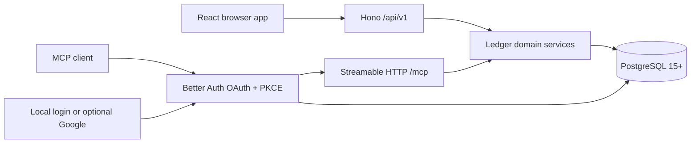

# Architecture

Simple Balance is one Node process and one deployable image. PostgreSQL holds
all the state. The browser and MCP clients call the same ledger services, so an
agent action goes through the same scoping, validation, and audit as a click.

`/api/v1` is the first stable HTTP contract version. It tracks the contract, not
the application release number, so it changes only when the contract breaks.

## Boundaries

- `src/shared` owns Zod request contracts, money/date primitives, and portable CSV
  normalization.
- `src/server/services` owns tenancy, optimistic concurrency, idempotency, audit
  events, double-entry postings, summaries, staging, and import/export. The API
  and MCP layers call these same functions.
- `src/server/api.ts` is a transport adapter. It obtains the user from Better Auth
  and never accepts a ledger owner in public input.
- `src/server/mcp.ts` exposes discrete tools and filters them by OAuth scope.
- `src/client` renders what the server computes. It never derives a balance of
  its own. Lists page by number against a server-supplied total row count;
  cursor paging remains available for reading a whole ledger straight through.

## Ledger invariants

- Money at JSON and MCP boundaries is always a decimal string.
- Account currency or crypto asset symbol is immutable after any opening balance,
  committed posting, or staged reference. Crypto wallets track native quantities;
  they do not create market prices, valuation, or a global FX rate.
- The books are double-entry. Every transaction settles to zero in each
  currency it touches, and nothing is written unless it does.
- A deposit credits the destination account and debits the income account. A
  withdrawal debits the source account and credits the expense account. An
  opening balance credits the account and debits the equity account, so where
  an account started is recorded in the books rather than beside them. All
  counter-accounts are created by the server, one per kind and currency, and
  never appear in account lists or pickers.
- Balances come from postings alone. No balance query reads a running total off
  the account row.
- A same-currency transfer moves between the two accounts directly. A
  conversion settles through the exchange account so each currency balances on
  its own rather than netting across the pair.
- Cross-currency transfers retain the sent and received amounts. The implied
  rate is audit and display metadata, not a global rate.
- Postings are append-only. Changing an amount, account, or type reverses the
  existing postings and writes a new set, so the rows still sum to the current
  position and the path there stays readable. Editing only labels writes no
  postings at all.
- Deleted transactions keep their postings but are excluded by all balance and
  report queries.
- Transaction mass edits and deletes are validate-first and atomic. Explicit
  selections use row versions; all-matching selections use a server-issued count
  and fingerprint of the filtered `id:version` set so concurrent changes make the
  request stale instead of silently changing its scope. A single request covers
  at most 10,000 rows, and the HTTP body limit for bulk endpoints is sized from
  that same cap.
- Bulk account changes preserve native currency. Transfers may receive common
  field edits but cannot be collapsed into deposits or withdrawals in bulk.
- Staged rows never affect balances.
- Mass stage commit validates all rows first and runs in one PostgreSQL
  transaction.
- Every transaction requires a payee; its description is optional. Category and
  payee entry canonicalizes exact existing matches case-insensitively, while
  category and payee links open their filtered transaction views.
- Payees remain required canonical text on transactions rather than a separate
  mutable database entity. The payee list is a tenant-scoped projection of
  committed and staged transaction text; merging rewrites those references
  atomically, bumps their versions, and records audit events.
- Bank CSV staging resolves category and payee names with the same Unicode,
  whitespace, and case normalization used by the rest of the application.
  Missing categories are created, incompatible category applicability broadens
  to Both, and new payee text becomes visible through the derived payee list.

## Request flow and tenancy

Web requests use a same-origin secure session cookie. MCP requests use a scoped
OAuth access token. Both resolve an internal `Actor`; every service query includes
`actor.userId`. IDs from a different user resolve as not found.

Migrations run at process startup under PostgreSQL advisory lock `724202607`, so
concurrent starts cannot race. Readiness stays closed until configuration, the
database connection, and migrations all succeed. Nothing has shipped yet, so the
schema is a single baseline migration that gets regenerated as it changes. Once
a version ships, that baseline freezes and every later change becomes its own
forward-only migration. See [upgrades and schema evolution](upgrades.md).

MCP OAuth access tokens are wrapped as audience-bound RS256 JWTs. The persistent
private/public JWK pair lives in `auth_mcp_signing_key`; only public key material
is returned by the JWKS endpoint. A valid JWT must still resolve to its
non-expired Better Auth access-token row, preserving revocation and scoped
consent.
