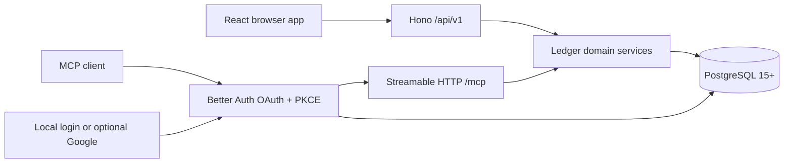

# Architecture

Simple Balance is one Node process and one deployable image. PostgreSQL is the only
stateful dependency. Its browser and AI/MCP clients share one ledger service
layer, so automation is scoped, validated, and audited like every other action.

`/api/v1` is the first stable HTTP contract version. It is independent of the
application release number (`0.1.0`) and changes only for an incompatible API
contract.

## Boundaries

- `src/shared` owns Zod request contracts, money/date primitives, and portable CSV
  normalization.
- `src/server/services` owns tenancy, optimistic concurrency, idempotency, audit
  events, signed postings, summaries, staging, and import/export. The API and MCP
  layers call these same functions.
- `src/server/api.ts` is a transport adapter. It obtains the user from Better Auth
  and never accepts a ledger owner in public input.
- `src/server/mcp.ts` exposes discrete tools and filters them by OAuth scope.
- `src/client` uses everyday language and does not calculate authoritative
  balances.

## Ledger invariants

- Money at JSON and MCP boundaries is always a decimal string.
- Account currency is immutable after any opening balance, committed posting, or
  staged reference.
- A deposit has one positive destination posting.
- A withdrawal has one negative source posting.
- A transfer has a negative source posting and positive destination posting.
- Cross-currency transfers retain the sent and received native amounts. The
  implied rate is audit/display metadata, not a global rate.
- Deleted transactions keep their postings but are excluded by all balance and
  report queries.
- Staged rows never affect balances.
- Mass stage commit validates all rows first and runs in one PostgreSQL
  transaction.

## Request flow and tenancy

Web requests use a same-origin secure session cookie. MCP requests use a scoped
OAuth access token. Both resolve an internal `Actor`; every service query includes
`actor.userId`. IDs from a different user resolve as not found.

Database migrations run at process startup under PostgreSQL advisory lock
`724202607`, so concurrent starts cannot race. Readiness remains unavailable
until configuration, database connection, and migrations succeed. The 0.1.0
schema is one initial migration. Every later schema change is a new,
forward-only migration that preserves existing records and backfills required
data; operators only replace the application image and restart it. The complete
contract is in [upgrades and schema evolution](upgrades.md).

MCP OAuth access tokens are wrapped as audience-bound RS256 JWTs. The persistent
private/public JWK pair lives in `auth_mcp_signing_key`; only public key material
is returned by the JWKS endpoint. A valid JWT must still resolve to its
non-expired Better Auth access-token row, preserving revocation and scoped
consent.
