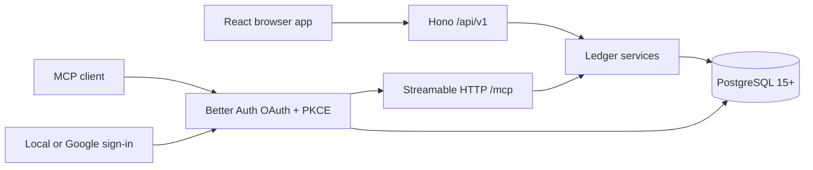

# Architecture

One Node process, one image, one PostgreSQL database. The browser and any MCP
client call the same ledger code, so an agent's action goes through the same
scoping, validation, and audit trail as a click.

`/api/v1` versions the HTTP contract, not the product. It changes when the
contract breaks, which is not the same as when the app does.

## Where things live

| Path | What is in it |
| --- | --- |
| `src/shared` | Zod contracts, money and date primitives, CSV normalisation. Imported by both sides. |
| `src/server/services` | The ledger itself: tenancy, concurrency, idempotency, postings, summaries, staging, import/export, audit. |
| `src/server/api.ts` | HTTP transport. Resolves the user from Better Auth and calls services. |
| `src/server/mcp.ts` | MCP transport. Exposes tools and filters them by OAuth scope. |
| `src/server/recurrence-scheduler.ts` | The loop that proposes recurring transactions, and the lock that keeps one replica doing it. |
| `src/server/db` | Drizzle schema, migration runner, connection pool. |
| `src/client` | The browser app. Renders what the server computed. |
| `drizzle` | Generated SQL migrations and their snapshots. |
| `tests` | Unit tests; `tests/integration` needs a real PostgreSQL. |
| `scripts` | Release helper, development database bootstrap, the Ralph loop. |

Both transports are adapters. Anything that decides something belongs in a
service, so the browser and an agent cannot drift apart.

## What the ledger guarantees

Money is a decimal string at every JSON and MCP boundary, and `numeric(44,18)`
in PostgreSQL. No binary floating point goes anywhere near a balance.

The books are double-entry. Every transaction settles to zero in each currency it
touches, and that is checked before anything is written. A deposit credits the
destination and debits income. A withdrawal debits the source and credits
expense. A same-currency transfer moves between the two accounts. A conversion
settles through the exchange account, so each currency balances on its own
rather than netting across the pair. An opening balance credits the account and
debits equity, which is how where an account started ends up inside the books
instead of beside them.

Archiving an account is the closing entry to that opening one: whatever the
account still holds is posted out to the same equity account and the account
ends at zero. It stays at zero: correcting or deleting a transaction that ran
through a closed account re-closes it, so an ordinary correction cannot leave
money stranded somewhere no total counts. That is what lets a total leave archived accounts out without
going wrong, and restoring the account posts the balance back. A closing pair
is dated the later of today and the account's last posting, so an account
holding something dated later still ends at zero rather than reviving on that
day; a balance as of an earlier date is untouched, because the money was
genuinely there then.

Those counter-accounts belong to the server, one per kind and currency. They
never appear in a list or a picker, and no transaction can name one as a side.

Postings are append-only. Correcting an entry works out the difference per
account, currency, and date, then appends only that, so changing an amount costs
one adjusting row per side. An edit that changes nothing about the movement
writes nothing at all. Deleting posts the reversal and restoring posts it back,
which is why no balance or report has to remember to filter deleted rows: a
voided entry already nets to zero.

Each posting carries its own date. Balances, cash flow, and spending by category
therefore read one table, and a balance as of a date is an indexed range rather
than a scan of the ledger. Labels are the exception. Which category an entry was
filed under is read from the transaction, or from the leg the posting belongs
to, which is why recategorising updates past reports rather than only future
ones.

A split transaction is that counter-account side cut into legs. Each leg is a
row holding one category and one amount, and each leg's share is posted under
its own leg id, so a hundred-pound receipt split three ways is three postings
adding to a hundred rather than one posting counted three times. Because the
legs are those postings, "the legs add up to the total" is the zero-sum check
that was already running: there is no way to write a split that satisfies one
and not the other, and no balance query changes a line. Relabelling a leg is a
single update that writes no postings at all, since the leg's identity does not
change when its label does. A leg is zeroed rather than deleted, because the
postings naming it are append-only; it falls out of every report through the
same "sums to nothing" filters that void a deleted entry. A transfer names an
account on both sides, so it has no counter-account side to partition and is
never split.

Balances come from postings and nothing else. No query reads a running total off
an account row.

The dashboard stops at today. An open-ended range used to mean the end of time,
so an entry dated next month counted toward a figure the page called "as of
today" while the cash flow beside it counted the same entry as money that had
moved. The summary reports the day it actually used, and its balance, cash flow,
and category figures all cover the same accounts and the same days: leave
archived accounts out and their activity goes out with them, ask for them and
both come back. A closed account comes back holding zero, because that is what
it holds: its balance left for equity when it was archived, and only the
activity that ran through it returns to the flow figures.

Currencies stay put. An account's currency is fixed once it is in use, and a
posting's currency is tied to its account's by foreign key. Cross-currency
transfers keep the sent and received amounts separately; the implied rate is
metadata, not a rate applied anywhere else.

Bulk changes validate first and then apply atomically. Explicit selections carry
row versions. All-matching selections carry a server-issued count and a
fingerprint of the filtered `id:version` set, so a concurrent change makes the
request stale rather than quietly changing what it covers. One request covers at
most 10,000 rows, and the HTTP body limit is sized from that cap. Account changes
preserve native currency, and a transfer cannot be collapsed into a deposit or a
withdrawal in bulk.

Staged rows never touch balances. Committing a batch validates every row first
and runs in a single PostgreSQL transaction. A staged mass edit uses the same
two selection shapes, resolved through the same filter predicates the queue
listing uses, so a selection can only ever cover rows that were on screen. It
writes drafts rather than postings, and revalidates each row it writes, so the
queue's verdict on a row is current the moment the edit lands. A row it cannot
give exactly one account to, a transfer or a row with no type yet, is refused
rather than skipped: skipping would report a number of rows changed that does
not match the selection.

A template is a saved starting point for the transaction form, not a record of
anything: it posts nothing and never touches a balance. The account and category
it names live inside its JSON with no foreign key, deliberately, because a key
would cascade and tidying up an old account would take the saved template with
it. What it holds instead is an id resolved when the template is used and
dropped, with a note, when it no longer resolves. Ownership of those ids is
checked when the template is written rather than when it is read.

A transaction records which template it was started from. That is provenance
rather than current state, so it carries no foreign key: deleting a template is
allowed and leaves the transactions made from it untouched, which a restricting
key would forbid and a cascading one would turn into data loss. The count of
committed entries reads the column; the count of staged ones reads the draft
JSON, the same way category counts do, so a row carries its template through
every edit without a second write path.

Templates have their own screen, and a mass edit there names every row outright
with the version it was read at. It carries no fingerprinted filter selection,
because a person can hold two hundred templates and the browser has all of them:
the filtered contract exists for rows the client has never loaded, which cannot
happen here. A patch key left out leaves that field alone, a value sets it, and
`null` clears it back to blank so the form asks for it on use; an empty string is
refused rather than read as a clear. Changing a template's type drops whichever
account side the new type cannot hold, and only when the patch names a type at
all; setting a side the type cannot hold is refused outright, because nothing
asked for the first and something did ask for the second.

Every transaction has a payee. It is canonical text on the transaction rather
than a table of its own, and the payee list is a projection of committed and
staged text. Merging rewrites every reference at once, bumps versions, and
writes audit events.

A category is a real row, so its list is cheap and its usage counts are not.
They are read from `ledger_transaction` and `staged_transaction` rather than
from postings, which is allowed because a row count is not a monetary figure;
money still comes only from postings. The counts are served from their own
endpoint rather than added to the category list, because most callers of that
list are pickers rendering a dropdown and would be paying for two aggregates to
do it. Both are aggregated before they are joined: counting across the join
reports one for a category nothing references, and the two sides multiplied
together when both match.

Lists order by any column they show, in either direction. Order is presentation
rather than scope, so it stays out of the fingerprinted bulk selection. A cursor
records the ordering it was issued for and is refused under another; orderings a
keyset cannot resume page by number instead.

## Tenancy

Browser requests carry a same-origin secure session cookie. MCP requests carry a
scoped OAuth access token. Both resolve to an internal `Actor`, and every service
query is scoped by `actor.userId`. An id belonging to someone else comes back as
not found, not as forbidden.

No public input ever names a user. One deployment may hold many people; each
sees only their own accounts, transactions, categories, payees, totals, and
audit history. The counter-accounts the ledger keeps for income, expenses,
exchange, and opening balances belong to a user too, so one person's spending
can never land in another's income statement.

Deleting an account removes the row in `auth_user`, and every table holding
somebody's data references it with `on delete cascade`, so the ledger goes with
it in one statement. That is deliberately the whole mechanism: a hand-kept list
of tables to empty is a list somebody forgets to add to, and what it forgets is
data left behind after a person asked for it to be gone. A table added later
with a `user_id` and no cascade does not leave data quietly, it makes the
deletion fail, which is the safe way for that mistake to surface. The one thing
no cascade reaches is `auth_verification`, which has no user column; a pending
password reset holds the user id in its value and is removed explicitly.

Deleting is reachable only with a session cookie. Every `/api/v1` route resolves
one, so an MCP token cannot reach it and no agent can delete the person whose
ledger it was lent a corner of.

`ALLOWED_EMAILS` is consulted when an account is created and at no other time.
It is optional, so making it a condition of signing in would shut everyone out
of a deployment that never set one.

## Migrations

They run at process startup under PostgreSQL advisory lock `724202607`, so two
containers starting together cannot race. Readiness stays closed until
configuration, the connection, and the migrations have all succeeded.

Migrations are forward-only, and a migration is frozen once it ships in a
release: by then it has run against somebody's data, and rewriting it would put
their schema and its recorded history out of step. Every schema change after
that is a new migration. See [upgrades](upgrades.md).

## The scheduler

One thing in this system writes without anybody asking it to, and what it writes
is a proposal. On a recurrence's due date it puts an ordinary staged row in the
review queue and posts nothing, which is what keeps "every posting was made by
somebody who was there" true with a scheduler in the picture.

It lives inside the server process and is on by default, so the single container
this is documented as needs nothing extra. `RECURRENCE_SCHEDULER=false` switches
it off, which is how a Kubernetes deployment hands the job to a container of its
own.

Two independent things stop the same occurrence being proposed twice.
`pg_try_advisory_lock(724202610)`, session-level and on a connection of its own,
lets one replica tick at a time; a replica that loses returns immediately rather
than queueing behind work the winner is already doing. It is session-level
because a tick commits once per recurrence, so a transaction-scoped lock would
release at every one of those commits. Underneath it, a partial unique index on
`(user_id, recurrence_id, occurrence_date)` means a second insert of the same
occurrence raises rather than lands, taking the watermark advance down with it,
since both are in one transaction.

Catch-up is a watermark comparison rather than a query: every occurrence strictly
after `max(last_occurrence_date, proposes_from - 1 day)` and no later than today
where that person lives, in bounded batches. `proposes_from` is fixed at creation
and never rewritten, so catch-up can only ever mean downtime and never history.

The one query in the product that does not lead with a tenant is the sweep that
finds what is due, because the scheduler has to find the work before it can know
whose it is. It reads two columns and a timezone; everything below it runs
through an `Actor` built from the user id the row carried.

## MCP tokens

Access tokens are audience-bound RS256 JWTs. The signing key pair lives in
`auth_mcp_signing_key`; the JWKS endpoint publishes only the public half. A valid
JWT still has to resolve to a live Better Auth access-token row, so revoking
consent takes effect immediately rather than when the token happens to expire.
