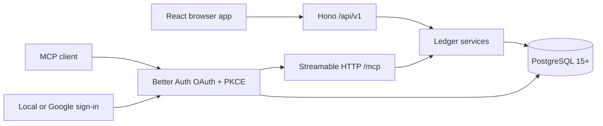

# Architecture

One Node process, one image, one PostgreSQL database. The browser and any MCP
client call the same ledger code, so an agent's action goes through the same
scoping, validation, and audit trail as a click.

`/api/v1` versions the HTTP contract, not the product. It changes when the
contract breaks, which is not the same as when the app does.

## Where things live

| Path | What is in it |
| --- | --- |
| `src/shared` | Zod contracts, money and date primitives, CSV normalisation. Imported by both sides. |
| `src/server/services` | The ledger itself: tenancy, concurrency, idempotency, postings, summaries, staging, import/export, audit. |
| `src/server/api.ts` | HTTP transport. Resolves the user from Better Auth and calls services. |
| `src/server/mcp.ts` | MCP transport. Exposes tools and filters them by OAuth scope. |
| `src/server/db` | Drizzle schema, migration runner, connection pool. |
| `src/client` | The browser app. Renders what the server computed. |
| `drizzle` | Generated SQL migrations and their snapshots. |
| `tests` | Unit tests; `tests/integration` needs a real PostgreSQL. |
| `scripts` | Release helper, development database bootstrap, the Ralph loop. |

Both transports are adapters. Anything that decides something belongs in a
service, so the browser and an agent cannot drift apart.

## What the ledger guarantees

Money is a decimal string at every JSON and MCP boundary, and `numeric(44,18)`
in PostgreSQL. No binary floating point goes anywhere near a balance.

The books are double-entry. Every transaction settles to zero in each currency it
touches, and that is checked before anything is written. A deposit credits the
destination and debits income. A withdrawal debits the source and credits
expense. A same-currency transfer moves between the two accounts. A conversion
settles through the exchange account, so each currency balances on its own
rather than netting across the pair. An opening balance credits the account and
debits equity, which is how where an account started ends up inside the books
instead of beside them.

Those counter-accounts belong to the server, one per kind and currency. They
never appear in a list or a picker, and no transaction can name one as a side.

Postings are append-only. Correcting an entry works out the difference per
account, currency, and date, then appends only that, so changing an amount costs
one adjusting row per side. An edit that changes nothing about the movement
writes nothing at all. Deleting posts the reversal and restoring posts it back,
which is why no balance or report has to remember to filter deleted rows: a
voided entry already nets to zero.

Each posting carries its own date. Balances, cash flow, and spending by category
therefore read one table, and a balance as of a date is an indexed range rather
than a scan of the ledger. Labels are the exception. Which category an entry was
filed under is read from the transaction, which is why recategorising updates
past reports rather than only future ones.

Balances come from postings and nothing else. No query reads a running total off
an account row.

Currencies stay put. An account's currency is fixed once it is in use, and a
posting's currency is tied to its account's by foreign key. Cross-currency
transfers keep the sent and received amounts separately; the implied rate is
metadata, not a rate applied anywhere else.

Bulk changes validate first and then apply atomically. Explicit selections carry
row versions. All-matching selections carry a server-issued count and a
fingerprint of the filtered `id:version` set, so a concurrent change makes the
request stale rather than quietly changing what it covers. One request covers at
most 10,000 rows, and the HTTP body limit is sized from that cap. Account changes
preserve native currency, and a transfer cannot be collapsed into a deposit or a
withdrawal in bulk.

Staged rows never touch balances. Committing a batch validates every row first
and runs in a single PostgreSQL transaction.

Every transaction has a payee. It is canonical text on the transaction rather
than a table of its own, and the payee list is a projection of committed and
staged text. Merging rewrites every reference at once, bumps versions, and
writes audit events.

Lists order by any column they show, in either direction. Order is presentation
rather than scope, so it stays out of the fingerprinted bulk selection. A cursor
records the ordering it was issued for and is refused under another; orderings a
keyset cannot resume page by number instead.

## Tenancy

Browser requests carry a same-origin secure session cookie. MCP requests carry a
scoped OAuth access token. Both resolve to an internal `Actor`, and every service
query is scoped by `actor.userId`. An id belonging to someone else comes back as
not found, not as forbidden.

No public input ever names a user. One deployment may hold many people; each
sees only their own accounts, transactions, categories, payees, totals, and
audit history. The counter-accounts the ledger keeps for income, expenses,
exchange, and opening balances belong to a user too, so one person's spending
can never land in another's income statement.

`ALLOWED_EMAILS` is consulted when an account is created and at no other time.
It is optional, so making it a condition of signing in would shut everyone out
of a deployment that never set one.

## Migrations

They run at process startup under PostgreSQL advisory lock `724202607`, so two
containers starting together cannot race. Readiness stays closed until
configuration, the connection, and the migrations have all succeeded.

The 0.1.0 baseline is frozen. Every schema change since is its own
forward-only migration, because a database out there has already run what came
before. See [upgrades](upgrades.md).

## MCP tokens

Access tokens are audience-bound RS256 JWTs. The signing key pair lives in
`auth_mcp_signing_key`; the JWKS endpoint publishes only the public half. A valid
JWT still has to resolve to a live Better Auth access-token row, so revoking
consent takes effect immediately rather than when the token happens to expire.
